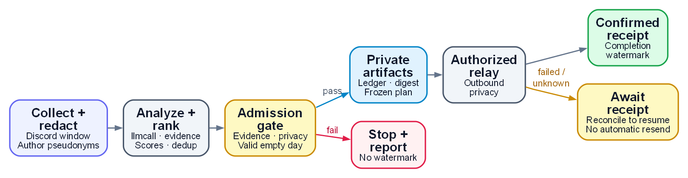

# demand-mining

Daily user-demand mining + competitor/hotspot tracking + EOD brainstorm + RICE/Kano quantified iteration ranking, for a shipped product.

[](https://docs.anthropic.com/en/docs/claude-code)
[](LICENSE)
[](ROADMAP.md)
[](#languages)
[](ROADMAP.md)

[English](README.md) | [中文版](README_CN.md)

---

## Design Philosophy

A feedback thread mixes requests, workarounds and repeated reports. The model proposes an
interpretation of that material; deterministic scoring, deduplication and evidence gates then decide
which candidates can enter the pool or digest. Keeping those steps separate makes a ranking
reproducible without treating a model's confidence as proof of a demand.

Collection redacts structured personal data and pseudonymizes authors before model processing or
persistence. That does not guarantee removal of names or sensitive free-form prose. Inputs must
respect those limits, and real observations and reports stay in a PRIVATE versioned companion.
Distinct-author evidence limits repeated-message inflation; an empty qualified result is valid output.

The skill owns demand-specific collection and the local finalization workflow. It delegates model
routing to installed `llmcall` and reminder operations to the installed scheduler CLI. Automated
competitor collection and the sister-skill research loop remain separate, deferred integrations.
This keeps the current workflow testable while leaving implicit-demand recall and score calibration
as measured quality questions rather than promises made by the pipeline.

[Read the full design philosophy](PHILOSOPHY.md).

## What it is (and isn't)

**Is:** a daily demand radar for one shipped product. It ingests product-community signal (Discord),
extracts real demands (explicit *and* implicit, JTBD-grounded), pools them with cross-day dedup and
distinct-author intensity, ranks them on three orthogonal axes (RICE for order, Opportunity for
strength, WSJF for urgency, Kano for nature), and emits an EOD brainstorm with a prioritized
iteration-direction queue.

The shipped Discord tap and daemon collect demand-specific feedback. The batch workflow uses the
`schedule-reminder` CLI, while the daemon also maintains its private demand pool. Automated hotspot
and competitor collection remain deferred integrations; the tool does not implement a general research engine.

## How a scheduled run works

Before enabling scheduled delivery, authorize its relay and destination. A scheduled run does not
pause for interactive approval; the local finalizer checks the saved artifacts and delivery receipt.

<p align="center">
  <a href="docs/diagrams/workflow-en.png"></a>
</p>

[Diagram source](docs/diagrams/workflow-en.dot) · [Render PNGs](docs/diagrams/render.py)

Analysis uses `llmcall` to propose demand clusters, binds quotes to collected evidence and merges
exact canonical-key duplicates. RICE, Opportunity and WSJF scoring applies Kano rules; comparison
with the product ledger assigns NEW, SUPPRESS or RESURFACE across days. The saved plan is frozen
and its artifacts checked before delivery. A matching confirmed receipt permits the completion
watermark; the caller must finish before the next collection window.

An empty day is valid only after collection and classification finish successfully. Collection,
model or validation failures remain failures. Headlines contain no URLs or handles; full evidence
stays in PRIVATE storage. A retry reuses the saved plan and confirmed receipt. An uncertain send
needs verified receipt reconciliation before the same run can finish; backup status is tracked separately.

Ledger operations use the `schedule-reminder` CLI. The daemon separately maintains its own private
demand pool. Shared-bot listening and automatic hotspot/competitor feeds remain deferred integrations.
See the [runtime contract](docs/runtime-contract.md) for recovery and storage details.

## Install

```
/plugin install github:DaizeDong/demand-mining
```

Or clone manually:

```bash
git clone --recurse-submodules https://github.com/DaizeDong/demand-mining.git ~/.claude/plugins/demand-mining
```

## Quick start

```bash
# offline preview — runs the full deterministic tail with no writes, no network
python skills/demand-mining/scripts/run.py --in candidates.json --dry-run --no-ledger

# real EOD after the private setup and preflight described below
powershell -ExecutionPolicy Bypass -File skills/demand-mining/scripts/register-task.ps1 -Time 21:53
```

`candidates.json` supplies candidate demand clusters to the deterministic pipeline. The caller
must provide their source evidence; automated competitor collection and the external hotspot
integration remain deferred. The gate runs redact → score → dedup → verify → push → pool → digest →
watermark.

## How to invoke

Trigger words: **需求挖掘 · demand mining · 迭代建议 · EOD 汇总**, or the daily scheduled run.

## Example output

**Pushed to Discord**, ONE ranked *headlines* message/day (top ≤5 archivable demands), not an embed
per demand:

```
📊 **需求头条** · 2026-07-15
合格 8 · 精选 5 · 剔噪 1 · 候选 12

**1.【立即·刚需】可靠地导出我的数据**
用户反复手动逐月下载再转表格，几十分钟重复劳动，论坛高频抱怨。建议：一键区间导出 CSV/Excel。
A 78 · RICE=9 · 3证据
...
📄 完整版（全部字段 + RICE + 证据）: 私有归档 2026/2026-07-15.md
```

The 【】 tag is the demand's **urgency·need-type** (立即/本周/本月 · 刚需/期望/惊喜). Unlike the
`daily-hotspots` sibling the headline carries **no url**, this skill mines private conversation and
the fail-closed egress gate aborts on any link, so evidence stays private and the full digest is
pointed at by a plain-text hint.

The **archived** digest file keeps the full iteration-direction queue, each line showing all three axes:

```
1. [tier0/immediate] reliably export my data — final 78 · RICE(R=6,I=3,C=1.0,E=2)=9 ·
   Opp=16(intensity 12, 4 人) · WSJF=4.8 · Kano=must_be · 竞品 competitorX · 证据×3
```

plus Quick-win / Big-bet pools. On a quiet day it honestly prints `今日无合格新需求`.

## Config

`demand-mining` is **config-bearing**, it reads per-product tunables (RICE weights, thresholds, Kano
map, taxonomy, push limits) and secrets (pseudonym HMAC salt, Discord creds) from a **separate,
private** companion config repo. Full contract: [CONFIG.md](CONFIG.md). Pure offline helpers
can use `skills/demand-mining/scripts/lib.py:DEFAULT_CONFIG` without configuration. Real
collection, initialization and writes require the private repository prerequisites below.

- **Mount:** `DEMAND_MINING_CONFIG` → `DEMAND_MINING_CONFIG_DIR` → shared Guards discovery. `DEMAND_MINING_DATA_DIR` must belong to the same companion. See [CONFIG.md](CONFIG.md#discovery-convention-e2) for the exact layout and fallback order.
- **First time:** Create or clone the private companion repository, configure its origin,
  and prepare the verified PRIVATE visibility receipt before running the initializer.
  See [Configuration and DATA](docs/runtime-contract.md#configuration-and-data).
  An ordinary unversioned directory is insufficient.
  ```bash
  python scripts/init_config.py --product <slug>  # stamp skeleton (deterministic)
  export DEMAND_MINING_CONFIG=~/.demand-mining-config                   # or pass --out <dir>
  python scripts/verify_config.py                  # doctor: PASS/FAIL, names gaps
  ```
- **Switch configs (hot-swap):** point the env var at another config dir, configs are self-contained,
  clear or update the DATA override with it: `export DEMAND_MINING_CONFIG=~/configs/work` ↔ `~/configs/personal`.
- **Required setup:** review `product_id` and IANA `timezone`, attach an existing private ledger,
  and configure Discord channels/token reference plus a stable pseudonym salt for collection.
  See CONFIG.md and the runtime contract before the doctor or scheduled preflight.
- **Secrets:** Mode B is the template default and needs out-of-band backup. A selected Mode A
  may version credentials in verified PRIVATE Git and restore from that history. The
  pseudonym salt may instead come from `$DEMAND_MINING_PSEUDONYM_SALT`.

## Limitations

- **Daemon mode must be chosen for the deployment.** In `--mode shadow`, direct @-mentions and DMs
  can receive replies and the admin activity log can be updated; unsolicited community replies stay
  disabled. Review the actual deployment and its evidence before authorizing `--mode live`.
  The presence of daemon code does not establish that a service is running.
- **Privacy-held live observations wait for a person.** An observation the privacy screen keeps
  holding moves to `pool/quarantine/` in the private companion after bounded retries. There is no
  replay command yet; review each record and replay or reject it explicitly.
- The **product code root is still `@DEFERRED`** (see [CONFIG.md](CONFIG.md)). It is reserved and the
  EOD pipeline does not need it, so nothing is blocked; the cost is that a ranked demand cannot yet
  be traced to the code that would implement it.
- **Competitor tracking is model-supplied, not collected.** Scoring consumes a `competitor_status`
  field (a competitor that just shipped the feature raises time-criticality), but the automated
  competitor changelog diff and the daily-hotspots / market-intel closed loop are still roadmap.
- Implicit-demand recall is the hard part; it improves by adding adversarial fixtures over time.
- Kano is an LLM proxy (no survey). Calibration against real forum judgments still needs a scoped
  evaluation; this documentation does not establish that one is running or complete.

## Languages

English (`README.md`, authoritative) · 中文 (`README_CN.md`)

## Roadmap · Contributing · License

See [ROADMAP.md](ROADMAP.md) · [CONTRIBUTING.md](CONTRIBUTING.md) · [LICENSE](LICENSE) (MIT).
