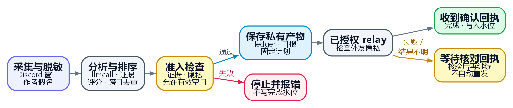

# demand-mining

面向已发布产品维护者的需求分析工具：采集 Discord 反馈，归并重复需求，用 RICE、Opportunity、WSJF 和 Kano 生成每日迭代建议队列。

[](https://docs.anthropic.com/en/docs/claude-code)
[](LICENSE)
[](ROADMAP.md)
[](#语言)
[](ROADMAP.md)

[English](README.md) | [中文版](README_CN.md)

---

## 设计理念

一段反馈里常常混着请求、临时绕过办法和重复报告。模型先解释这些材料，再由确定性的评分、
去重和证据检查决定哪些候选可以进入需求池或日报。把解释与裁决分开，排名才便于复算，也不会
将模型的自信当成需求成立的证据。

采集阶段先脱去结构化个人信息，并为作者生成假名，再交给模型或写入记录。这不能保证清除姓名
和敏感散文，输入仍需遵守这些限制；真实观察和报告保存在 PRIVATE 版本化伴生仓。
按独立作者累计证据可以减少重复发言造成的虚高，没有合格需求也是有效结果。

技能负责需求采集和本地收尾流程，模型路由交给已安装的 `llmcall`，提醒操作通过已安装的调度器
CLI 完成。自动采集竞品变更以及与其他技能联动调研仍是待接入项。现有流程因此可以单独验证；
隐性需求召回和评分校准的效果，则要靠测量判断，不能由流水线替它们作保证。

[完整设计理念](PHILOSOPHY.md)。

## 它是什么(不是什么)

Discord REST tap 和 gateway daemon 采集产品社群反馈。流程从中提取显性与隐性的 JTBD 需求，
跨日去重，按独立作者累计证据，并生成包含 Quick-win 和 Big-bet 两类建议的 EOD 汇总。

批处理通过 `schedule-reminder` CLI 操作提醒，daemon 另行维护私有需求池。
共享 bot 监听、热点和竞品自动采集仍待接入。手动调研可使用 `daily-hotspots` 或 `market-intel`，
纳入的外部证据必须保留独立来源。

## 定时运行流程

启用定时推送前，先授权所用的 relay 和发送目的地。定时运行不会逐次暂停询问；本地收尾程序负责
核对已保存的产物和发送回执。

<p align="center">
  <a href="docs/diagrams/workflow-cn.png"></a>
</p>

[图源代码](docs/diagrams/workflow-cn.dot) · [生成 PNG](docs/diagrams/render.py)

分析阶段由 `llmcall` 提出候选需求簇，将引文绑定到采集证据，并合并 canonical key 完全相同的候选。
随后计算 RICE、Opportunity 和 WSJF，应用 Kano 规则，再对照该产品的 ledger 跨日判断
NEW、SUPPRESS 或 RESURFACE。发送前先固定计划并核对产物；收到匹配的确认回执后才能写完成水位，
调用方完成后再进入下一采集窗口。

只有采集和分类都成功完成，才允许输出空日报。采集、模型或校验失败仍按失败处理。头条不含 URL
或账号提及，完整证据保存在 PRIVATE 存储中。重试复用已保存的计划和确认回执；发送结果不明时，
必须用经过核验的回执完成核对，才能继续完成同一次运行。备份状态单独记录。

身份、恢复和回执要求见[运行契约](docs/runtime-contract.md)。

## 安装

```
/plugin install github:DaizeDong/demand-mining
```

或手动克隆：

```bash
git clone --recurse-submodules https://github.com/DaizeDong/demand-mining.git ~/.claude/plugins/demand-mining
```

## 快速开始

```bash
# 离线预览：执行确定性处理，不写入、不联网
python skills/demand-mining/scripts/run.py --in candidates.json --dry-run --no-ledger

# 完成下方私有配置和预检后，注册 EOD 任务
powershell -ExecutionPolicy Bypass -File skills/demand-mining/scripts/register-task.ps1 -Time 21:53
```

`candidates.json` 提供候选需求簇及其来源证据。采集、持久化和凭回执完成的过程见上方定时运行流程。

## 如何触发

触发词：**需求挖掘 · demand mining · 迭代建议 · EOD 汇总**,或每日定时运行。

## 示例输出

**推送到 Discord**, 每日一条排序「需求头条」(top ≤5 可推送需求),不再逐需求发卡片：

```
📊 **需求头条** · 2026-07-15
合格 8 · 精选 5 · 剔噪 1 · 候选 12

**1.【立即·刚需】可靠地导出我的数据**
用户反复手动逐月下载再转表格,几十分钟重复劳动,论坛高频抱怨。建议:一键区间导出 CSV/Excel。
A 78 · RICE=9 · 3证据
...
📄 完整版(全部字段 + RICE + 证据): 私有归档 2026/2026-07-15.md
```

【】标签是需求的**紧迫度·需求性质**(立即/本周/本月 · 刚需/期望/惊喜)。与 `daily-hotspots` 孪生不同，
头条**不含任何链接**, 本 skill 挖私密对话，fail-closed 出口门遇链接即中止，证据保持私有，完整 digest
用纯文本指针指向私有归档。

**归档**的 digest 文件保留完整迭代方向队列，每行三轴齐显：

```
1. [tier0/immediate] reliably export my data — final 78 · RICE(R=6,I=3,C=1.0,E=2)=9 ·
   Opp=16(intensity 12, 4 人) · WSJF=4.8 · Kano=must_be · 竞品 competitorX · 证据×3
```

加 Quick-win / Big-bet 双池。空日诚实打印 `今日无合格新需求`。

## 配置

`demand-mining` 是**带 config 的 skill**, 每产品的可调参数(RICE 权重、阈值、Kano 映射、taxonomy、
推送上限)与密钥(假名 HMAC salt、Discord 凭证)都放在一个**独立、私有**的伴随 config 仓里。完整规范见
[CONFIG.md](CONFIG.md)。纯离线函数可以使用内置默认值；真实采集、初始化和写入都需要先准备好私有仓。

- **挂载：** `DEMAND_MINING_CONFIG` 优先，`DEMAND_MINING_CONFIG_DIR` 为别名，随后使用 Guards 的统一发现规则。`DEMAND_MINING_DATA_DIR` 必须属于同一个伴生仓。完整顺序与目录布局见 [CONFIG.md](CONFIG.md#discovery-convention-e2)。
- **首次配置：** 先创建或克隆私有伴生仓，配置 origin，并准备已核验为 PRIVATE 的可见性记录，再运行初始化命令。
  普通的未纳入版本管理的目录不满足要求。详见 [Configuration and DATA](docs/runtime-contract.md#configuration-and-data)。
  ```bash
  python scripts/init_config.py --product <slug>  # 生成骨架(确定性)
  export DEMAND_MINING_CONFIG=~/.demand-mining-config                   # 或给 init 传 --out <dir>
  python scripts/verify_config.py                  # doctor:逐项 PASS/FAIL 报缺
  ```
- **切换 config(即插即用):** 把环境变量指向另一个 config 目录即可， config 自包含，同时清除或更新 DATA 覆盖值：
  `export DEMAND_MINING_CONFIG=~/configs/work` ↔ `~/configs/personal`。
- **必填配置：** 先核对 `product_id` 和 IANA `timezone`，连接已有的私有 ledger；采集还需要
  Discord 频道、token 引用和稳定的假名 salt。填写完成后再跑 doctor 和相应能力的 preflight。
- **密钥：** 模板默认 Mode B，需要独立备份；明确选择 Mode A 后可在已核验的 PRIVATE Git
  仓中版本化，并从其历史恢复。公开源码始终不放凭据。假名 salt 也可改由
  `$DEMAND_MINING_PSEUDONYM_SALT` 提供。

## 局限

- **部署时须明确选择 daemon 模式。** `--mode shadow` 可以回复直接 @ 或 DM，也可更新管理活动
  日志，但不会主动回复无人召唤的社群闲聊。授权 `--mode live` 前，先核对实际部署及其证据。
  仓库里有 daemon 代码，不能证明服务正在运行。
- **被隐私筛查反复拦下的实时观测要等人处理。** 有限次重试后，这类观测会移到私有伴生仓的
  `pool/quarantine/`。目前没有回放命令，需要逐条审阅，再明确回放或拒绝。
- **产品代码根仍是 `@DEFERRED`**(见 [CONFIG.md](CONFIG.md))。它是预留项，EOD 流水线不需要它，
  所以没有东西被卡住；代价是排好序的需求暂时无法追溯到实现它的那段代码。
- **竞品情报靠模型给，不是自动采集。** 打分会消费 `competitor_status` 字段(竞品刚发布该功能会抬高
  时间紧迫度),但自动化的竞品 changelog diff 与 daily-hotspots / market-intel 闭环仍在 roadmap 上。
- 隐性需求召回是死穴，靠持续扩充对抗 fixture 迭代提升。
- Kano 为 LLM 代理，没有问卷依据。与真实论坛判断的校准仍需要明确范围的评估，
  本文不能证明评估正在进行或已经完成。

## 语言

中文 (`README_CN.md`) · English (`README.md`, 权威版)

## Roadmap · 贡献 · 许可

见 [ROADMAP.md](ROADMAP.md) · [CONTRIBUTING.md](CONTRIBUTING.md) · [LICENSE](LICENSE)(MIT)。
